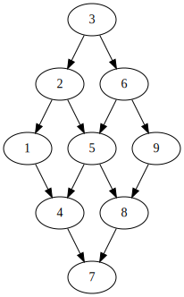
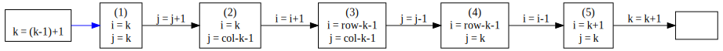

[一、二维数组中的查找](#一、二维数组中的查找)

[二、重建二叉树](#二、重建二叉树)

[三、两个栈实现队列](#三、两个栈实现队列)

[四、旋转数组的最小数字](#四、旋转数组的最小数字)

[五、斐波那契数列](#五、斐波那契数列)

[六、跳台阶💙](#六、跳台阶💙)

[七、变态跳台阶 💙](#七、变态跳台阶 💙)

[八、矩形覆盖](#八、矩形覆盖)

[九、二进制中1的个数](#九、二进制中1的个数)

[十、数值的数字次方](#十、数值的数字次方)

[十一、链表的倒数第k个结点](#十一、链表的倒数第k个结点)

[十二、合并两个排序的链表](#十二、合并两个排序的链表)

[十三、树的子结构](#十三、树的子结构)

[十四、二叉树的镜像](#十四、二叉树的镜像)

[十五、顺时针打印矩阵 💙](#十五、顺时针打印矩阵 💙)

[十六、栈的压入，弹出序列💙](#十六、栈的压入，弹出序列💙)

[十七、从上往下打印二叉树](#十七、从上往下打印二叉树)

[十八、二叉树后序遍历序列💙](#十八、二叉树后序遍历序列💙)

## 一、二维数组中的查找

>## 题目描述
>
>在一个二维数组中，每一行都按照从左到右递增的顺序排序，每一列都按照从上到下递增的顺序排序。请完成一个函数，输入这样的一个二维数组和一个整数，判断数组中是否含有该整数。


```c++
// 方法一
class Solution {
public:
    bool Find(int target, vector<vector<int> > array) {
        size_t y = array.size();
        size_t x = array[0].size();
        
        size_t l = 0, r = x-1;
        for(size_t i = 0; i < y; ++i)
        {
            l = 0;
            r = x-1;
            while(l <= r)
            {
                size_t mid = l + ((r - l) >> 1);
                int n = array[i][mid];
                if(n > target)
                {
                    r = mid - 1;
                } else if(n < target)
                {
                    l = mid + 1;
                } else
                    return true;
            }
        }
        return false;
    }
};
```

```c++
// 优化1
// 运行时间：14ms
// 占用内存：1352k
// 时间复杂度：O(row*log(col))
class Solution {
public:
    bool Find1(int target, vector<vector<int> > array) {
        int y = array.size();
        int x = array[0].size();
        
        int l = 0, r = x-1;
        for(int i = 0; i < y; ++i)
        {
            // l = 0;
            // r = x-1;
            int n = 0;
            while(l <= r)
            {
                int mid = l + ((r - l) >> 1);
                n = array[i][mid];
                if(n > target)
                {
                    r = mid - 1;
                } else if(n < target)
                {
                    l = mid + 1;
                } else
                    return true;
            }
            l = 0;
            if(n < target)
                r = x-1;
        }
        return false;
    }
};
```

```c++
// 方法二
// newcoder 不能使用`size_t`类型，否则编译不通过
// 运行时间：13ms
// 占用内存：1400k
// 时间复杂度：
//           最好O(1) 最差 O(row+col) 平均 O((row+col+1)/2)
class Solution {
public:
    bool Find(int target, vector<vector<int> > array) {
        int  y = array.size();
        int  x = array[0].size();
        
        int  col = x-1, row = 0;
        
        while(col >= 0 && row < y)
        {
            if(array[row][col] > target) {
                --col;
            } else if(array[row][col] < target) {
                ++row;
            } else 
                return true;
        }
        
        return false;
    }
};
```

一个从左到右递增，从上到下递增的二维数组：

|  1   |  2   |  3   |
| :--: | :--: | :--: |
|  4   |  5   |  6   |
|  7   |  8   |  9   |

可以看做一颗树(以右上角作为树根)：



也就是上面代码方法二的做法了，显然时间复杂度比方法一小。


## 二、重建二叉树

>## 题目描述
>
>输入某二叉树的前序遍历和中序遍历的结果，请重建出该二叉树。假设输入的前序遍历和中序遍历的结果中都不含重复的数字。例如输入前序遍历序列{1,2,4,7,3,5,6,8}和中序遍历序列{4,7,2,1,5,3,8,6}，则重建二叉树并返回。

### >> 思路

根据前序遍历的性质，前序遍历序列的第一个数就是根节点的值(如上面的`1`)，对应到中序遍历序列，其左右两边分别是根的左子树（4,7,2）和右子树(5,3,8,6）。再对左右子树分别递归操作，直到左右子树为空，结束。


```c++
// (1)
/**
 * Definition for binary tree
 * struct TreeNode {
 *     int val;
 *     TreeNode *left;
 *     TreeNode *right;
 *     TreeNode(int x) : val(x), left(NULL), right(NULL) {}
 * };
 */
// 运行时间：6ms
// 占用内存：592k

class Solution {
public:
    TreeNode* reConstructBinaryTree(vector<int> pre,vector<int> vin) {
        TreeNode *root = new TreeNode(0);
        
        buildSubBinaryTree(root, pre.begin(), vin.begin(), vin.size());
        return root;
        
    }
    void buildSubBinaryTree(TreeNode *root, vector<int>::iterator prebeg, vector<int>::iterator vinbeg, int n) {
        
        root->val = prebeg[0];
        
        auto vend = vinbeg+n;
        auto rt = find(vinbeg, vend, prebeg[0]);
        int lcount = rt-vinbeg;
        int rcount = vend-rt-1;
        if(lcount) {
            auto l = new TreeNode(prebeg[1]);
            root->left = l;
        }
        
        if(rcount) {
            auto r = new TreeNode(prebeg[lcount+1]);
            root->right = r;
        }
        
        if(lcount)
            buildSubBinaryTree(root->left, prebeg+1, vinbeg, lcount);
        if(rcount)
            buildSubBinaryTree(root->right, prebeg+lcount+1, rt+1, rcount);
    }
};
```

上面的代码有些参数重复计算，用变量代替，提高效率：

```c++
lSubPre = prebeg+1; // 左子树
rSubPre = lSubPre+lcount; // 右子树
```

```c++
/**
 * Definition for binary tree
 * struct TreeNode {
 *     int val;
 *     TreeNode *left;
 *     TreeNode *right;
 *     TreeNode(int x) : val(x), left(NULL), right(NULL) {}
 * };
 */

//运行时间：6ms
//占用内存：476k

class Solution {
public:
    TreeNode* reConstructBinaryTree(vector<int> pre,vector<int> vin) {
        TreeNode *root = new TreeNode(0);
        
        buildSubBinaryTree(root, pre.begin(), vin.begin(), vin.size());
        return root;
        
    }
    void buildSubBinaryTree(TreeNode *root, vector<int>::iterator prebeg, vector<int>::iterator vinbeg, int n) {
        
        root->val = prebeg[0];
        
        auto vend = vinbeg+n;
        auto rt = find(vinbeg, vend, prebeg[0]);
        int lcount = rt-vinbeg;
        int rcount = n-lcount-1; // rcount = vend-rt-1;

        auto lSubPre = prebeg+1; // 左子树
		auto rSubPre = lSubPre+lcount; // 右子树
        if(lcount) {
            auto l = new TreeNode(lSubPre[0]); // prebeg[1]
            root->left = l;
        }
        
        if(rcount) {
            auto r = new TreeNode(rSubPre[0]); // prebeg[lcount+1]
            root->right = r;
        }
        
        if(lcount)
            buildSubBinaryTree(root->left, lSubPre, vinbeg, lcount); // prebeg+1
        if(rcount)
            buildSubBinaryTree(root->right, rSubPre, rt+1, rcount); // prebeg+lcount+1
    }
};
```

把上面的递归版本转为迭代版本，我们需要一个栈来保存右子树的相关变量：

```c++
// (3) 迭代版本，每次迭代先构造左子树，右子树入栈，直到左子树为空，右子树出栈，构造右子树

/**
 * Definition for binary tree
 * struct TreeNode {
 *     int val;
 *     TreeNode *left;
 *     TreeNode *right;
 *     TreeNode(int x) : val(x), left(NULL), right(NULL) {}
 * };
 */
 // 运行时间：4ms
 // 占用内存：460k

class Solution {
public:
	struct Unit{ // 存放右子树的前序遍历，中序遍历序列，用于后续构造右子树
    	TreeNode *root; // 右子树的根
    	vector<int>::iterator pre; // 前序遍历序列首地址
    	vector<int>::iterator vin; // 中序遍历序列首地址
    	int    n; // 序列长度
    	Unit(TreeNode *r, vector::iterator p, vector::iterator v, int num)
        :root(r), pre(p), vin(v), n(num) {}
	};

	TreeNode* reConstructBinaryTree(vector<int> pre,vector<int> vin) {
    	TreeNode *root = new TreeNode(0);
		stack<Unit> stk;
    	int n = pre.size();
    	auto prebeg = pre.begin();
    	auto vinbeg = vin.begin();
    	auto vend = vin.end();
        TreeNode *rp = root;
		while(1) {
    		root->val = prebeg[0];
        	vend = vinbeg+n;
        	auto rt = find(vinbeg, vend, prebeg[0]);
        
        	int lcount = rt-vinbeg;
        	int rcount = n-lcount-1; // rcount = vend-rt-1;

        	auto lSubPre = prebeg+1; // 左子树
			auto rSubPre = lSubPre+lcount; // 右子树
    		if(lcount) {
        		// 插入当前根节点的左儿子
            	auto l = new TreeNode(lSubPre[0]); // prebeg[1]
            	root->left = l;
    		}
    		if(rcount) {
        		// 插入当前根节点的右儿子
            	auto r = new TreeNode(rSubPre[0]); // prebeg[lcount+1]
            	root->right = r;
        		// 右子树入栈
        		stk.push(Unit(r, rSubPre, rt+1, rcount));
    		}
    		if(lcount) {
                // 左子树非空，继续构造左子树
    			root = root->left;
            	prebeg = lSubPre;
            	n = lcount;
        	}
    		else { // 左子树为空，构造右子树
        		// 出栈
            	if(stk.empty())
                	return rp;
        		Unit top = stk.top();
                stk.pop();
            	root = top.root;
            	prebeg = top.pre;
            	vinbeg = top.vin;
            	n = top.n;
        	}
		}
	}
};
```

[相关博客链接](http://www.cnblogs.com/codingmengmeng/p/5856980.html)


***


## 三、两个栈实现队列

>## 题目描述
>
>用两个栈来实现一个队列，完成队列的Push和Pop操作。 队列中的元素为int类型。


```c++
// 运行时间：3ms
// 占用内存：488k
class Solution
{
public:
    void push(int node) {
        stack1.push(node);
    }

    int pop() {
        if(stack2.empty())
        {
            while(!stack1.empty()) {
                stack2.push(stack1.top());
                stack1.pop();
            }
        }
        int top = stack2.top();
        stack2.pop();
        return top;
    }

private:
    stack<int> stack1;
    stack<int> stack2;
};
```


## 四、旋转数组的最小数字

>## 题目描述
>
>把一个数组最开始的若干个元素搬到数组的末尾，我们称之为数组的旋转。 输入一个非递减排序的数组的一个旋转，输出旋转数组的最小元素。 例如数组{3,4,5,1,2}为{1,2,3,4,5}的一个旋转，该数组的最小值为1。 NOTE：给出的所有元素都大于0，若数组大小为0，请返回0。

```c++
// (1) 直接从后往前找，找到一个比前一个小的数时，返回。
// 时间复杂度
//          最好 O(1) 最坏 O(n)
// 运行时间：39ms
// 占用内存：616k

class Solution {
public:
    int minNumberInRotateArray(vector<int> rotateArray) {
        if(rotateArray.size() == 0)
            return 0;
        int pos = rotateArray.size()-1;
        while(rotateArray[pos-1] <= rotateArray[pos])
        {
            --pos;
        }
        return rotateArray[pos];
    }
};
```

```c++
// (2) 采用类似二分查找的方法，判断条件变为中间值比第一个数大时，向后查找；中间值比第一个数小时，先前查找，如果此时前一个数比中间值大，则返回。
// 运行时间：38ms
// 占用内存：740k

class Solution {
public:
    int minNumberInRotateArray(vector<int> rotateArray) {
        if(rotateArray.size() == 0)
            return 0;
        int r = rotateArray.size()-1;
        int l = 0;
        int val = rotateArray[0];
        while(1)
        {
            int mid = l + ((r-l) >> 1);
            int mval = rotateArray[mid];
            if(mval >= val)
            {
                l = mid+1;
            } else {
                if(mval < rotateArray[mid-1])
                    return mval;
                r = mid;
            }
        }
    }
};
```

## 五、斐波那契数列

>## 题目描述
>
>大家都知道斐波那契数列，现在要求输入一个整数n，请你输出斐波那契数列的第n项。
>
>n<=39


```c++
class Solution {
public:
    int Fibonacci(int n) {
        if(n == 0)
            return 0;
        if(n < 3)
            return 1;
        return Fibonacci(n-2)+Fibonacci(n-1);
    }
};
```

```c++
class Solution {
public:
    int Fibonacci(int n) {
        if(n <= 1)
            return n;
        
        int first = 0;
        int second = 1;
        
        int i = 0;
        while(++i < n)
        {
            int rc = 0;
            rc = first+second;
            first = second;
            second = rc;
        }
        return rc;
    }
};

// f(n) = f(n-2) + f(n-1);
```


## 六、跳台阶:blue_heart:

>## 题目描述(斐波那契数列方法)
>
>一只青蛙一次可以跳上1级台阶，也可以跳上2级。求该青蛙跳上一个n级的台阶总共有多少种跳法（先后次序不同算不同的结果）。

```c++
// 运行时间：6ms
// 占用内存：484k

// f(n) = f(n-1) + f(n-2), f(1) = 1, f(2) = 2
class Solution {
public:
    int jumpFloor(int number) {
        if(number <= 2)
            return number;
        
        // 当前台阶跳法总数 = 后退一阶跳法总数 + 后退两阶跳法总数
        int first = 1;
        int second = 2;
        while(number-- != 2)
        {
            int rc = first + second;
            first = second;
            second = rc;
        }
        return second;
    }
};
```

## 七、变态跳台阶 :blue_heart:

>## 题目描述
>
>一只青蛙一次可以跳上1级台阶，也可以跳上2级……它也可以跳上n级。求该青蛙跳上一个n级的台阶总共有多少种跳法。

### >> 思路

这是一个减治的思想。我们可以将问题规模不断缩小来求解我们要的答案。

1. 若青蛙第一次跳`1`级台阶，那么就剩`n-1`阶，问题规模转为求解`n-1`的情况；

2. 若青蛙第一次跳`2`级台阶，那么就剩`n-2`阶，问题规模转为求解`n-2`的情况；

3.  . . . . . .

4. 若青蛙第一次跳`n-1`阶，那么就剩`1`阶，问题规模转为求解`1`的情况；

5. 若青蛙第一次跳`n`阶，那么只有一种方法。

6. 将上面的每一步解答结果相加，就是`n`阶的答案了。

   

转化为数学公式：
$$
\begin{align*}
f(n)=f(n-1)+f(n-2)+f(n-3)+...+f(2)+f(1)+1
\end{align*}
$$


先用递归的方法：

```c++
class Solution {
public:
    int jumpFloorII(int number) {
        if(n < 2)
            return 1;
        
        int target = 0;
        for(int i = number-1; i >= 0; --i)
            target += jumpFloorII(i);
        return target;
    }
};
```

其实，由上面的数学公式可以推导出下面的公式：
$$
<1>f(n)=f(n-1)+f(n-2)+f(n-3)+...+f(2)+f(1)+1 \\
<2>f(n-1) = f(n-2)+f(n-3)+...+f(2)+f(1)+1\\
<1>-<2>: f(n) = 2f(n-1)
$$
代码实现如下：

```c++
// 运行时间：5ms
// 占用内存：364k
// f(n) = f(n-1) + f(n-2) + ... + f(1) + f(0)
// f(0) = 1
class Solution {
public:
    int jumpFloorII(int number) {
        if(number < 2)
            return 1;
        
        int target = 1;
        while(number-- > 1)
        {
            target *= 2;
        }
        return target;
    }
};
```


## 八、矩形覆盖

>## 题目描述(菲拉波切数列)
>
>我们可以用2*1的小矩形横着或者竖着去覆盖更大的矩形。请问用n个2*1的小矩形无重叠地覆盖一个2*n的大矩形，总共有多少种方法？

```c++
class Solution {
public:
    int rectCover(int number) {
        if(number < 2)
            return number;
        int target = 0;
        int first = 1;
        int second = 1;
        while(number-- >= 2)
        {
            target = first + second;
            first = second;
            second = target;
        }
        return target;
    }
};
```

***


## 九、二进制中1的个数

> ## 题目描述
>
> 输入一个整数，输出该数二进制表示中1的个数。其中负数用补码表示。

```c++
/*
运行时间：4ms
占用内存：376k
*/
// 注意要把`int`先存为`unsigned int`, 不然负数逻辑右移，不会等于0
class Solution {
public:
     int  NumberOf1(int n) {
         int count = 0;
         unsigned int num = n;
         while(num)
         {
             if(num & 0x1)
                 count += 1;
             num >>= 1;
         }
         return count;
     }
};
```

## 十、数值的数字次方

>## 题目描述
>
>给定一个double类型的浮点数base和int类型的整数exponent。求base的exponent次方。

```c++
// 运行时间：2ms
// 占用内存：356k

class Solution {
public:
    double Power(double base, int exponent) {
        long double power = base;
        long double result = 1;
        unsigned int exp = exponent;
        if(exponent < 0)
            exp = ~exp+1;
        while(exp)
        {
            if(exp & 0x1)
                result *= power;
            power *= power;
            exp >>= 1;
        }
        if(exponent < 0)
            result = 1.0 / result;
        return result;
    }
};
```


## 十一、链表的倒数第k个结点

>## 题目描述
>
>输入一个链表，输出该链表中倒数第k个结点。

```c++
// (1)
/*
struct ListNode {
	int val;
	struct ListNode *next;
	ListNode(int x) :
			val(x), next(NULL) {
	}
};*/
class Solution {
public:
    ListNode* FindKthToTail(ListNode* pListHead, unsigned int k) {
        if(pListHead == NULL)
            return NULL;
        
        vector<ListNode*> v;
        for(ListNode* p = pListHead; p != NULL; p = p->next)
        {
            v.push_back(p);
        }
        int i = v.size()-k;
        if(i < 0)
            return NULL;
        return v[i];
    }
};

// (2)
// 运行时间：3ms
// 占用内存：476k

/*
struct ListNode {
	int val;
	struct ListNode *next;
	ListNode(int x) :
			val(x), next(NULL) {
	}
};*/
class Solution {
public:
    ListNode* FindKthToTail(ListNode* pListHead, unsigned int k) {
        auto p = pListHead, p1 = pListHead;
        
        for(int i = 0; i != k; ++i)
        { // 跳过前面k个
            if(p1 == nullptr) return nullptr;
            else
                p1 = p1->next;
        }
        while(p1)
        { // 剩余的个数，从头开始算就是要找的节点了
            p1 = p1->next;
            p = p->next;
        }
        
        return p;
    }
};
```


## 十二、合并两个排序的链表

>## 题目描述
>
>输入两个单调递增的链表，输出两个链表合成后的链表，当然我们需要合成后的链表满足单调不减规则。

```c++
// 运行时间：2ms
// 占用内存：488k
/*
struct ListNode {
	int val;
	struct ListNode *next;
	ListNode(int x) :
			val(x), next(NULL) {
	}
};*/
class Solution {
public:
    ListNode* Merge(ListNode* pHead1, ListNode* pHead2)
    {
        ListNode p(0);
        ListNode *pn = &p;
        
        while(pHead1 && pHead2) {
            if(pHead1->val < pHead2->val) {
                pn->next = pHead1;
                pHead1 = pHead1->next;
            }
            else {
                pn->next = pHead2;
                pHead2 = pHead2->next;
            }
            pn = pn->next;
        }
        
        if(pHead1) { // 若pHead1非空，接在pn后面
            pn->next = pHead1;
        } else {
            pn->next = pHead2;
        }
        
        return p.next;
    }
};
```

## 十三、树的子结构

>## 题目描述
>
>输入两棵二叉树A，B，判断B是不是A的子结构。（ps：我们约定空树不是任意一个树的子结构）

```c++
// 运行时间：3ms
// 占用内存：480k
/*
struct TreeNode {
	int val;
	struct TreeNode *left;
	struct TreeNode *right;
	TreeNode(int x) :
			val(x), left(NULL), right(NULL) {
	}
};*/
class Solution {
public:
    bool HasSubtree(TreeNode* pRoot1, TreeNode* pRoot2)
    {
        if(pRoot2 == nullptr)
            return false;
        TreeNode* t;
        bool rc = false;
        
        if((t = search(pRoot1, pRoot2->val)) != nullptr) {
            if((rc = HasSamenodes(t, pRoot2)) == true)
                return rc;
            else {
                return HasSubtree(t->left, pRoot2) || HasSubtree(t->right, pRoot2);
            }
        }
        return false;
        
    }
    
    TreeNode* search(TreeNode* root, int val)
    { // 查找是否有val值，找到返回相应的节点指针，找不到返回`nullptr`
        if(root == nullptr)
            return nullptr;
        
        if(root->val == val)
            return root;
        else if(root->val < val)
            return search(root->right, val);
        else
            return search(root->left, val);
    }
    
    bool HasSamenodes(TreeNode* root1, TreeNode *root2)
    { // 查看两颗树是否有完全相同节点（从根节点起）
        bool rl, rr; 
        if(root2 == nullptr)
            return true; // 还有其他情况
        else if(root1 == nullptr) //  && root2 != nullptr
            return false;
        else if(root1->val == root2->val) {
            rl = HasSamenodes(root1->left, root2->left);
            rr = HasSamenodes(root1->right, root2->right);
        } else {
            return false;
        }
        return rl && rr;
    }
};
```

```c++
// 递归
bool HasSamenodes(TreeNode* root1, TreeNode *root2)
{ // 查看两颗树是否有完全相同节点（从根节点起）
    bool rl, rr; 
    if(root2 == nullptr)
        return true;
    else if(root1 == nullptr) //  && root2 != nullptr
        return false;
    else if(root1->val == root2->val) {
        rl = HasSamenodes(root1->left, root2->left);
        rr = HasSamenodes(root1->right, root2->right);
    } else {
        return false;
    }
    return rl && rr;
}

// 迭代
bool HasSamenodes(TreeNode* root1, TreeNode *root2)
{
    stack<TreeNode*> stk; // 存放两棵树的右子树根节点
    while(1)
    {
        if(root2 == nullptr)
        {
            if(stk.empty())
        		return true;
            root2 = stk.top();
            stk.pop();
            root1 = stk.top();
            stk.pop();
            continue;
        }
        else if(root1 == nullptr || root1->val != root2->val)
            return false;
        
        stk.push(root1->right);
        stk.push(root2->right);
        root1 = root1->left;
        root2 = root2->left;
    }
}
```

```c++
// 递归  {8,8,7,9,2,#,#,#,#,4,7},{8,9,2}？？
TreeNode* search(TreeNode* root, int val)
{ // 查找是否有val值，找到返回相应的节点指针，找不到返回`nullptr`
    if(root == nullptr)
        return nullptr;        
    if(root->val == val)
        return root;
    else if(root->val < val)
        return search(root->right, val);
    else
        return search(root->left, val);
}

// 迭代
TreeNode* search(TreeNode* root, int val)
{
    while(root)
    {
        if(root->val == val)
            return root;
        else if(root->val < val)
            root = root->right;
        else if(root->val > val)
            root = root->left;
    }
    return nullptr;
}
```

```c++
// 递归
bool HasSubtree(TreeNode* pRoot1, TreeNode* pRoot2)
{
    if(pRoot2 == nullptr)
        return false;
    TreeNode* t;
    bool rc = false;        
    
    if((t = search(pRoot1, pRoot2->val)) != nullptr) {
        if((rc = HasSamenodes(t, pRoot2)) == true)
            return rc;
        else {
            return HasSubtree(t->left, pRoot2) || HasSubtree(t->right, pRoot2);
        }
    }
    return false;        
}

// 迭代
bool HasSubtree(TreeNode* pRoot1, TreeNode* pRoot2)
{
    if(pRoot2 == nullptr)
        return false;
    stack<TreeNode*> stk;
    while(1)
    {
        TreeNode* t;
        bool rc = false;
        if((t = search(pRoot1, pRoot2->val)) != nullptr) {
            if((rc = HasSamenodes(t, pRoot2)) == true)
                return rc;
            else{
                pRoot1 = t->left;
                stk.push(t->right);
            }
        } else { // 左子树找不到，去右子树找，都找不到返回false
            if(stk.empty())
                return false;
            pRoot1 = stk.top();
            stk.pop();
        }
    }
}
```

```c++
// 迭代版本
// 运行时间：4ms
// 占用内存：480k
/*
struct TreeNode {
	int val;
	struct TreeNode *left;
	struct TreeNode *right;
	TreeNode(int x) :
			val(x), left(NULL), right(NULL) {
	}
};*/
class Solution {
public:
	bool HasSubtree(TreeNode* pRoot1, TreeNode* pRoot2)
	{
    	if(pRoot2 == nullptr)
        	return false;
    	stack<TreeNode*> stk;
    	while(1)
    	{
        	TreeNode* t;
            bool rc = false;
        	if((t = search(pRoot1, pRoot2->val)) != nullptr) {
            	if((rc = HasSamenodes(t, pRoot2)) == true)
                	return rc;
            	else{
                	pRoot1 = t->left;
                	stk.push(t->right);
            	}
        	} else { // 左子树找不到，去右子树找，都找不到返回false
            	if(stk.empty())
                	return false;
            	pRoot1 = stk.top();
            	stk.pop();
        	}
    	}
	}

	TreeNode* search(TreeNode* root, int val)
	{
    	while(root)
    	{
        	if(root->val == val)
            	return root;
        	else if(root->val < val)
            	root = root->right;
        	else if(root->val > val)
            	root = root->left;
    	}
    	return nullptr;
	}
	
	bool HasSamenodes(TreeNode* root1, TreeNode *root2)
	{
    	stack<TreeNode*> stk; // 存放两棵树的右子树根节点
    	while(1)
    	{
        	if(root2 == nullptr)
        	{
            	if(stk.empty())
        			return true;
            	root2 = stk.top();
            	stk.pop();
            	root1 = stk.top();
            	stk.pop();
            	continue;
        	}
        	else if(root1 == nullptr || root1->val != root2->val)
            	return false;
        
        	stk.push(root1->right);
        	stk.push(root2->right);
        	root1 = root1->left;
        	root2 = root2->left;
    	}
	}
};
```

```c++
// 链接：https://www.nowcoder.com/questionTerminal/6e196c44c7004d15b1610b9afca8bd88
// 来源：牛客网

class Solution {
    bool isSubtree(TreeNode* pRootA, TreeNode* pRootB) {
        if (pRootB == NULL) return true;
        if (pRootA == NULL) return false;
        if (pRootB->val == pRootA->val) {
            return isSubtree(pRootA->left, pRootB->left)
                && isSubtree(pRootA->right, pRootB->right);
        } else return false;
    }
public:
    bool HasSubtree(TreeNode* pRootA, TreeNode* pRootB)
    {
        if (pRootA == NULL || pRootB == NULL) return false;
        return isSubtree(pRootA, pRootB) ||
            HasSubtree(pRootA->left, pRootB) ||
            HasSubtree(pRootA->right, pRootB);
    }
};
```

## 十四、二叉树的镜像

>## 题目描述
>
>操作给定的二叉树，将其变换为源二叉树的镜像。
>
>## 输入描述:
>
>```
>二叉树的镜像定义：源二叉树 
>    	    8
>    	   /  \
>    	  6   10
>    	 / \  / \
>    	5  7 9 11
>    	镜像二叉树
>    	    8
>    	   /  \
>    	  10   6
>    	 / \  / \
>    	11 9 7  5
>```


```c++

/*
struct TreeNode {
	int val;
	struct TreeNode *left;
	struct TreeNode *right;
	TreeNode(int x) :
			val(x), left(NULL), right(NULL) {
	}
};*/
class Solution {
public:
    void Mirror(TreeNode *pRoot) {
        if(pRoot == nullptr)
            return;
        TreeNode *temp = pRoot->left;
        pRoot->left = pRoot->right;
        pRoot->right = temp;
        Mirror(pRoot->left);
        Mirror(pRoot->right);
    }
};
```


## 十五、顺时针打印矩阵 :blue_heart:

>## 题目描述
>
>输入一个矩阵，按照从外向里以顺时针的顺序依次打印出每一个数字，例如，如果输入如下矩阵： 
>
>[[1 2 3 4], [5 6 7 8],[9 10 11 12],[13 14 15 16]] 则依次打印出数字1,2,3,4,8,12,16,15,14,13,9,5,6,7,11,10.

#### >> 思路

以上面的例子，来看下结果的索引值有什么规律：

```c++
index i: 0, 0, 0, 0, 1, 2, 3, 3, 3, 3, 2, 1, 1, 1, 2, 2
index j: 0, 1, 2, 3, 3, 3, 3, 2, 1, 0, 0, 0, 1, 2, 2, 1
    
value  : 1, 2, 3, 4, 8,12,16,15,14,13, 9, 5, 6, 7,11,10
```

发现`index j`先增大`(0, 1, 2, 3)`，`index i`保持不变`(0)`，然后，`index i`增大`(0, 1, 2, 3)`，`index j`保持不变`(3)`，再`index j`减小`(3, 2, 1, 0)`，`index i`保持不变`(3)`，再`index i`减小`(3, 2, 1)`，`index j`保持不变`(0)`。接着，就是重复上面的规律了。

把上面的规律，放到表格，如下：

第一圈：

|        `index i`        | 0 +  |  0   |  0   |  0   |
| :---------------------: | :--: | :--: | :--: | :--: |
| `index j` (`j = j + 1`) | 0 +  |  1   |  2   |  3   |

| `index i` (`i = i + 1`) |  0   |  1   |  2   |  3   |
| :---------------------: | :--: | :--: | :--: | :--: |
|        `index j`        |  3   |  3   |  3   |  3   |

|        `index i`        |  3   |  3   |  3   |  3   |
| :---------------------: | :--: | :--: | :--: | :--: |
| `index j` (`j = j - 1`) |  3   |  2   |  1   |  0   |

| `index i` (`i = i - 1`) |  3   |  2   | 1 *  |
| :---------------------: | :--: | :--: | :--: |
|        `index j`        |  0   |  0   | 0 *  |

第二圈：

| `index i`               | 1    | 1 +  | 1    |
| ----------------------- | ---- | ---- | ---- |
| `index j` `(j = j + 1)` | 0    | 1 +  | 2    |

| `index i` `(i = i + 1)` | 1    | 2    |
| ----------------------- | ---- | ---- |
| `index j`               | 2    | 2    |

| `index i`               | 2    | 2 *  |
| ----------------------- | ---- | ---- |
| `index j` `(j = j - 1)` | 2    | 1 *  |

第二圈到第三步就遍历完所有数字了，提前结束。

表中标`+`表示每圈开始的索引值，与圈数相关；

标`*`表示每圈结束的索引值，`index i`比`index j`大`1`，与圈数相关。

我们设圈数为`k`，`k`从`0`开始算起。

每一圈的历程如下图：（`col`为矩阵列数，`row`为矩阵行数）



接着，我们要确定迭代的次数`k`：

一圈遍历的元素个数为
$$
\beta_k = 2(col+row)-4(2k+1)
$$
我们已知圈数为`k`，故元素总数为:
$$
row*col = \beta_0+\beta_1+\ldots+\beta_{k} \\
\quad\quad\quad\quad\quad\quad\quad\quad\quad\quad\quad\quad\quad\quad\quad\quad=2(k+1)(col+row)-4(1+3+\ldots+(2k+1))\\
\quad\quad\quad\quad\quad\quad\quad\quad\quad=2(k+1)(col+row)-4(k+1)^2
$$
即
$$
4(k+1)^2-2(k+1)(col+row)+row*col = 0\\
(2(k+1)-col)(2(k+1)-row)=0
\\得\quad\quad\quad\quad\quad\quad\quad\quad\quad\quad\quad\quad\quad k=\frac{col}{2}-1 或\frac{row}{2}-1
$$
因此，我们在两根中取较小者作为圈数。若为分数向上取整。

```c++
// 运行时间：3ms
// 占用内存：480k

// 注意一定要计数，不然会出现重复打印
class Solution {
public:
    vector<int> printMatrix(vector<vector<int> > matrix) {
        int row = matrix.size()-1;
        int col = matrix[0].size()-1;
        
        int n = (row < col ? row : col)/2+1;
        
        vector<int> vals;
        int count = 0;
        int num = (row+1)*(col+1);
        for(int k = 0; k < n; ++k)
        {
            int i = k, j = k;
            vals.push_back(matrix[i][j]);
            ++count;
            if(i == k && j == k) {
                while(j != col-k && count < num) {
                    vals.push_back(matrix[i][++j]);
                    ++count;
                }
            }
            if(i == k && j == col-k) {
                while(i != row-k && count < num) {
                    vals.push_back(matrix[++i][j]);
                    ++count;
                }
            }
            if(i == row-k && j == col-k) {
                while(j != k && count < num) {
                    vals.push_back(matrix[i][--j]);
                    ++count;
                }
            }
            if(i == row-k && j == k)    
                while(i > k+1 && count < num) {
                    vals.push_back(matrix[--i][j]);
                    ++count;
                }
            }
        }
        return vals;
    }
};
```

// 每个阶段的判断条件都和下一个状态重合，直接去掉判断：

```c++
// 在做判断时，大小比较该用大于号或小于号就用，不要作死使用不等号！！！！！！可能会越界
class Solution {
public:
    vector<int> printMatrix(vector<vector<int> > matrix) {
        int row = matrix.size()-1;
        int col = matrix[0].size()-1;
        
        int n = (row < col ? row : col)/2+1;
        
        vector<int> vals;
        int count = 0;
        int num = (row+1)*(col+1);
        for(int k = 0; k < n; ++k)
        {
            int i = k, j = k;
            vals.push_back(matrix[i][j]);
            ++count;

            while(j != col-k && count < num) {
                vals.push_back(matrix[i][++j]);
                ++count;
            }
            while(i != row-k && count < num) {
                vals.push_back(matrix[++i][j]);
                ++count;
            }
            while(j != k && count < num) {
                vals.push_back(matrix[i][--j]);
                ++count;
            }
            
            while(i > k+1 && count < num) {
                vals.push_back(matrix[--i][j]);
                ++count;
            }
        }
        return vals;
    }
};
```

上面这个采用计数的方法，不用计数也可以，需要会重复打印的情况：


当`col`或`row`为奇数时，圈数最后为半圈，这半圈的形成是从上面的一圈遍历中取出来的，怎么取呢？

1. 最后半圈只剩下一列，那么只有从上到下，而没有从下到上，即`(2)->(3)->结束`。

   此时，`j = k = col-k-1`，即`(1)->(2)`和`(3)->(4)`不会执行，

   为了避免`(4)->(5)`被执行，导致重复计数，我们应该在`(5)`加上判断`k!=col-k-1`，下面代码块有给出。

2. 最后半圈只剩下一行，那么只有从左向右，而没有从右到左，即`(1)->(2)->结束`。

   此时，`i = k = row-k-1`，即`(2)->(3)`和`(4)->(5)`不会执行，

   为了避免`(3)->(4)`被执行，导致重复计数，我们应该在`(4)`加上判断`k!=row-k-1`，下面代码块有给出。

```c++
class Solution {
public:
    vector<int> printMatrix(vector<vector<int> > matrix) {
        vector<int> vals;
        if(matrix.empty())
            return vals;
        int row = matrix.size()-1;
        int col = matrix[0].size()-1;
        
        int n = (row < col ? row+2 : col+2)/2;
        
        for(int k = 0; k < n; ++k)
        {
            int i = k, j = k;
            vals.push_back(matrix[i][j]);

            while(j < col-k) { // j = j + 1
                vals.push_back(matrix[i][++j]);
            }
            while(i < row-k) { // i = i + 1
                vals.push_back(matrix[++i][j]);
            }
            while(j > k && k != row-k) { // j = j - 1                                 
                vals.push_back(matrix[i][--j]);
                // 如果为奇数行矩阵，要避免重复打印，判断是否为同一行,k == row-k表示同一行
                // 为什么使用`k`而不使用`i`呢？
                // 这是因为如果不是奇数行矩阵，`i`值会增大，总会等于`row-k`
            }
            
            while(i > k+1 && k != col-k) { // 如果是奇数列矩阵，判断是否为同一列
                vals.push_back(matrix[--i][j]); // i = i - 1
            }
        }
        return vals;
    }
};
```


## 十六、栈的压入，弹出序列:blue_heart:

>## 题目描述 
>
>输入两个整数序列，第一个序列表示栈的压入顺序，请判断第二个序列是否为该栈的弹出顺序。假设压入栈的所有数字均不相等。例如序列1,2,3,4,5是某栈的压入顺序，序列4,5,3,2,1是该压栈序列对应的一个弹出序列，但4,3,5,1,2就不可能是该压栈序列的弹出序列。（注意：这两个序列的长度是相等的）

#### >>思路

利用一个辅助栈，按压栈顺序逐个压入，同时检查是否等于出栈序列值，是则弹出，最后，看栈是否为空。

```c++
// 运行时间：4ms
// 占用内存：484k
class Solution {
public:
    bool IsPopOrder(vector<int> pushV,vector<int> popV) {
        vector<int> stack;
        
        for(int i = 0, j = 0; i < pushV.size();)
        {
            stack.push_back(pushV[i++]);
            while(j < popV.size() && stack.back() == popV[j])
            {
                stack.pop_back();
                ++j;
            }
        }
        return stack.empty();
    }
};
```


## 十七、从上往下打印二叉树

>## 题目描述
>
>从上往下打印出二叉树的每个节点，同层节点从左至右打印。

```c++
// 运行时间：3ms
// 占用内存：476k

/*
struct TreeNode {
	int val;
	struct TreeNode *left;
	struct TreeNode *right;
	TreeNode(int x) :
			val(x), left(NULL), right(NULL) {
	}
};*/
class Solution {
public:
    vector<int> PrintFromTopToBottom(TreeNode* root) {
        vector<int> vals;
        queue<TreeNode*> que;
        
        if(root == nullptr)
            return vals;
        que.push(root);
        while(!que.empty())
        {
            root = que.front();
            que.pop();
            vals.push_back(root->val);
            if(root->left)
                que.push(root->left);
            if(root->right)
                que.push(root->right);
        }
        return vals;
    }
};
```


## 十八、二叉树后序遍历序列:blue_heart:

>## 题目描述
>
>输入一个整数数组，判断该数组是不是某二叉搜索树的后序遍历的结果。如果是则输出Yes,否则输出No。假设输入的数组的任意两个数字都互不相同。

#### >>思路

以最后一个数，即根为依据，把二叉树的左右子树部分分开，左子树一定小于根，右子树一定大于根，递归左右子树，有不符合的返回`false`。

```c++
// 运行时间：3ms
// 占用内存：376k

class Solution {
public:
    bool VerifySquenceOfBST(vector<int> sequence) {
        if(sequence.empty())
            return false;
        stack<int> stk;
        int begin = 0, last = sequence.size()-1;
        while(1) {
            int b = begin;
            for(; b < last && sequence[b] < sequence[last]; ++b);
            int mid = b;
            for(b = b+1; b < last; ++b) 
            {
                if(sequence[b] < sequence[last])
                    return false;
            }
        
            if(mid-2 > begin) {
                stk.push(mid); // 右子树开始位置
                stk.push(last); // 右子树结束位置
                last = mid-1;
            }
            else if(last-2 > mid) {
                begin = mid;
                last -= 1; // 最后一个位置记得更新，不然会死循环
            }
            else {
                if(stk.empty()) return true;
                last = stk.top();
                stk.pop();
                begin = stk.top();
                stk.pop();
            }
        }
    }
};
```

```c++
// 别人的迭代版本
链接：https://www.nowcoder.com/questionTerminal/a861533d45854474ac791d90e447bafd
来源：牛客网

//非递归 
//非递归也是一个基于递归的思想：
//左子树一定比右子树小，因此去掉根后，数字分为left，right两部分，right部分的
//最后一个数字是右子树的根他也比左子树所有值大，因此我们可以每次只看有子树是否符合条件
//即可，即使到达了左子树左子树也可以看出由左右子树组成的树还想右子树那样处理
 
//对于左子树回到了原问题，对于右子树，左子树的所有值都比右子树的根小可以暂时把他看出右子树的左子树
//只需看看右子树的右子树是否符合要求即可
class Solution {
public:
    bool VerifySquenceOfBST(vector<int> sequence) {
        int size = sequence.size();
        if(0==size)return false;
 
        int i = 0;
        while(--size)
        {
            while(sequence[i++]<sequence[size]);
            while(sequence[i++]>sequence[size]);
 
            if(i<size)return false;
            i=0;
        }
        return true;
    }
};
```


